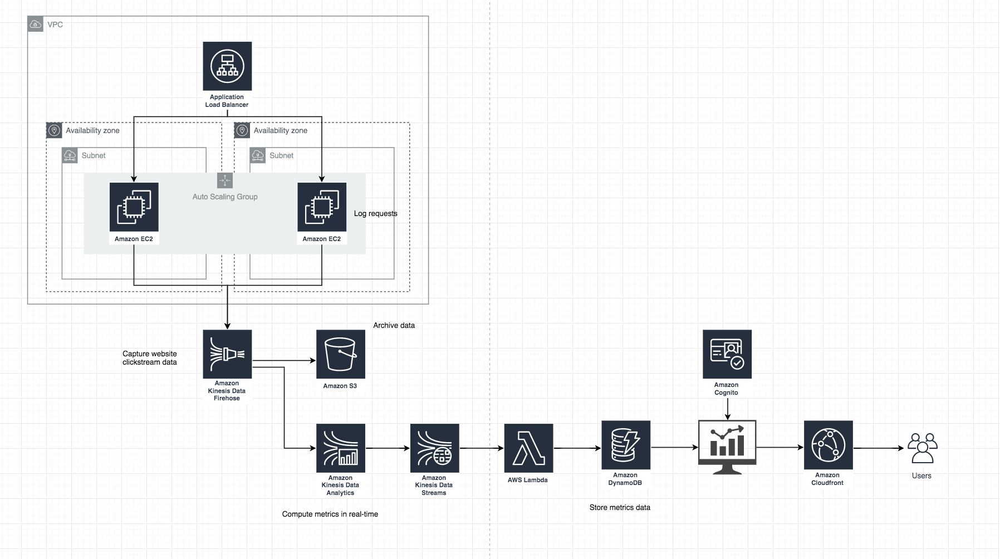

# PayPay Software Engineer Challenge

## Coding Task
The immutable queue uses two immutable stacks, backwards and forwards, to keep track of the items being enQueued and deQueued, respectively. Runtime of enQueue() is O(1), and deQueue() is O(n).

Run `com.ue.App` for checking the result.

## Design Question
Design Question: Design A Google Analytic like Backend System. We need to provide Google Analytic like services to our customers. Pls provide a high level solution design for the backend system. Feel free to choose any open source tools as you want.

The system needs to:
- handle large write volume: Billions write events per day.
- handle large read/query volume: Millions merchants want to get insight about their business. Read/Query 
- provide metrics to customers with at most one hour delay.
- run with minimum downtime.
- have the ability to reprocess historical data in case of bugs in the processing logic.

## Architecture on AWS
Architecture on AWS.

### handle large write volume: Billions write events per day.
#### Solution
1. Use ALB to handle load balancing the requests from web browser.
2. Configure auto scaling group to automatically scale out EC2 instances.
3. Configure DynamoDB to scale auto automatically. (DynamoDB can handle more than 10 trillion requests per day)

### handle large read/query volume: Millions merchants want to get insight about their business. Read/Query patterns are time-series related metrics.

#### Assumption
Read access pattern might be to read today's events most frequently, yesterday's events much less frequently, and then older events very little at all.

#### Solution
Building the current date and time into the primary key in DynamoDB to allocate the required resources for the current period.

1. Create one table per period, provisioned with the required read and write capacity and the required indexes.
2. Before the end of each period, prebuild the table for the next period. Just as the current period ends, direct event traffic to the new table. You can assign names to these tables that specify the periods they have recorded.
3. As soon as a table is no longer being written to, reduce its provisioned write capacity to a lower value (for example, 1 WCU) and provision whatever read capacity is appropriate. Reduce the provisioned read capacity of earlier tables as they age. You may choose to archive or delete the tables whose contents will rarely or never be needed.

### provide metrics to customers with at most one hour delay.
#### Solution
Amazon Kinesis Data Analytics allows to track website activity in real-time. Visualize web usage metrics including events per hour, visitor count, user agents, abnormal events, aggregate event count, referrers, and recent events.

### run with minimum downtime.
#### Solution
By using managed service by AWS, we can minimize downtime as much as possible.
The architecture does not have SPOF, so that we can have high availability.

#### SLA in AWS
- LoadBalancer	: 99.99% availability
- CloudFront	: 99.9％ availability
- DynamoDB		: 99.9％ availability
- EC2			: 99.99％ availability
- Lambda		: 99.95％ availability
- Kinesis Data 	: 99.9％ availability

### have the ability to reprocess historical data in case of bugs in the processing logic.
#### Solution
Data is archived in S3. So, we can reprocess historical data.

